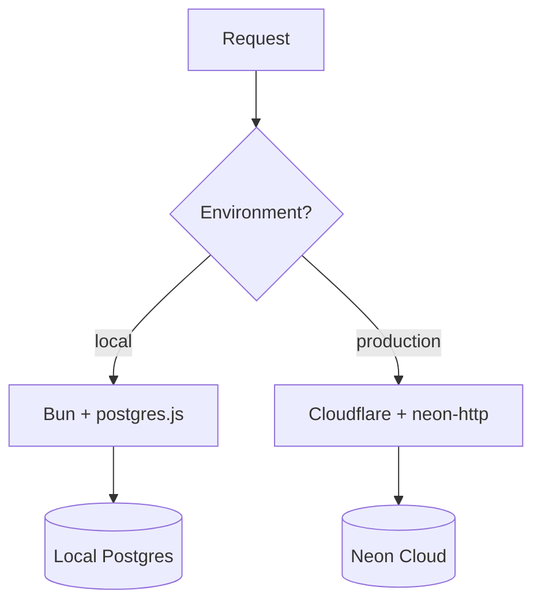

# Technical Design: backend-cloud-deployment

## Architecture Overview

The backend will transition from a single-driver model to a multi-driver factory model. This allows the same codebase to run seamlessly in Bun (local) and Cloudflare Workers (production).

### 1. Database Client Factory

We will implement a `getDb()` factory function in `apps/backend/src/db/index.ts`.



### 2. Wrangler Configuration

File: `apps/backend/wrangler.toml`

```toml
name = "impenetrable-backend"
main = "src/index.ts"
compatibility_date = "2024-05-01"
compatibility_flags = ["nodejs_compat"]

[vars]
ENVIRONMENT = "production"

# Secrets (managed via CLI)
# DATABASE_URL
# JWT_SECRET
```

### 3. Build & Bundling

Wrangler will use `bun` for bundling to ensure `@repo/shared` and other workspace dependencies are correctly resolved. The entry point `src/index.ts` will use the Hono `hono/cloudflare-workers` entry point if necessary, or a generic entry point that Hono manages.

### 4. Makefile Updates

We will add the following targets:

- `backend-login`: `cd apps/backend && bunx wrangler login`
- `backend-deploy`: `cd apps/backend && bunx wrangler deploy`
- `backend-logs`: `cd apps/backend && bunx wrangler tail`
- `backend-secret-set`: `cd apps/backend && bunx wrangler secret put`

## Secret Management

| Secret         | Purpose                | Source       |
| -------------- | ---------------------- | ------------ |
| `DATABASE_URL` | Neon Connection String | Neon Console |
| `JWT_SECRET`   | Auth signing key       | Generated    |

## Migration Strategy

Migrations will be handled from the local machine using `make db-migrate-neon`. This pushes the schema changes to the Cloud database before the code is deployed.
