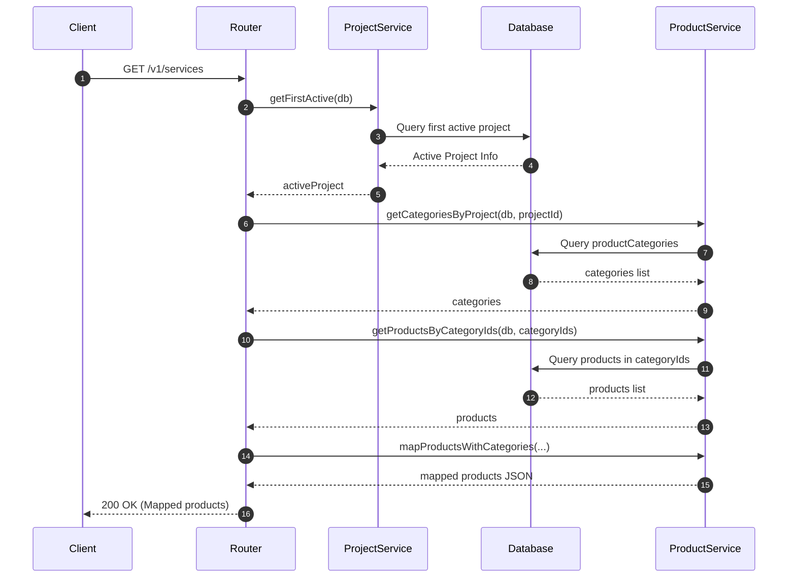

# Design: Extract backend route logic to services and add HTTP constants

This document outlines the architecture and design decisions for refactoring the backend database query logic out of route handlers and into dedicated service modules, as well as centralizing HTTP constants.

## Architecture

We are decoupling the HTTP/routing layer (Hono routers) from the data access layer (services calling Drizzle ORM).



## Architectural Rationale

1. **Decoupling and Testing**: Moving database queries to service modules allows us to test business logic independently of the HTTP routing framework (Hono) using unit tests.
2. **Reusability**: Core queries (e.g. fetching active categories for a project) can be reused across different endpoints (e.g., `/v1/products` and `/v1/services`).
3. **HTTP Safety & Standards**: Replacing magic numbers like `200` and `500` with descriptive constants (`HTTP_OK`, `HTTP_INTERNAL_ERROR`) prevents spelling and status mistakes.
4. **Standardized Named Exports**: Avoid default exports in routers to enforce explicit named imports throughout the backend application.

## Proposed Changes

### [NEW] `apps/backend/src/constants/http-status.ts`

Export numeric constants:

```typescript
export const HTTP_OK = 200;
export const HTTP_CREATED = 201;
export const HTTP_NO_CONTENT = 204;
export const HTTP_BAD_REQUEST = 400;
export const HTTP_NOT_FOUND = 404;
export const HTTP_INTERNAL_ERROR = 500;
```

### [NEW] `apps/backend/src/services/project.service.ts`

Implement `ProjectService` class using static methods.
Queries use Drizzle:

- `db.select().from(projects).orderBy(desc(projects.zzz_is_active), projects.zzz_name)`
- `db.select().from(projects).where(eq(projects.zzz_id, id)).limit(1)`

### [NEW] `apps/backend/src/services/venture.service.ts`

Implement `VentureService` class. Contains queries for `ventures` and `ventureMembers`.

### [MODIFY] `apps/backend/src/services/product.service.ts`

Add static class `ProductService` wrapping:

- `getCategoriesByProject(db, projectId)`
- `getProductsByCategoryIds(db, categoryIds)`
- `mapProductsWithCategories(items, categories, projectId)` (helper map)

### [MODIFY] `apps/backend/src/routes/projects.ts`

Replace queries with `ProjectService` calls. Use HTTP status constants.

### [MODIFY] `apps/backend/src/routes/ventures.ts`

Replace queries with `VentureService` calls. Use HTTP status constants.

### [MODIFY] `apps/backend/src/routes/products.ts`

Replace queries with `ProductService` calls. Use HTTP status constants.

### [MODIFY] `apps/backend/src/routes/services.ts`

Replace queries with `ProjectService` and `ProductService` calls. Use HTTP status constants.

### [MODIFY] `apps/backend/src/app.ts`

Update router imports:

```diff
-import projectsRouter from "./routes/projects";
+import { projectsRouter } from "./routes/projects";
```
