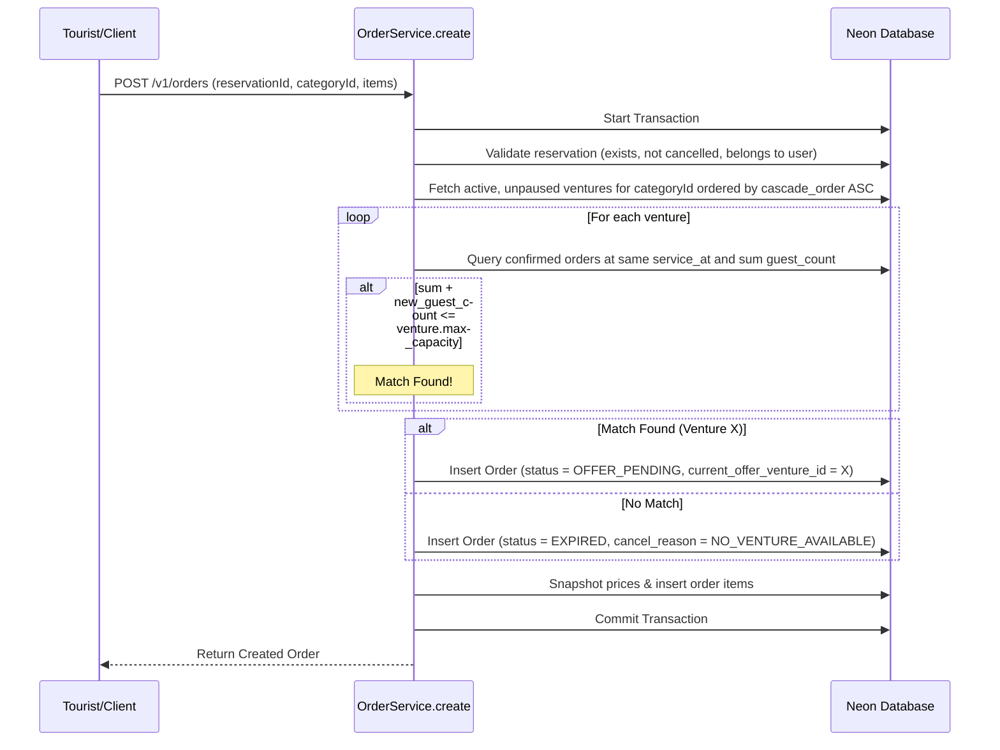

# Technical Design: API Order Matching & Venture Capacity Routing

## Architecture Overview

This design outlines the refactoring of category field naming (from `zzz_catalog_type_id` to `zzz_product_category_id`) and the implementation of a synchronous venture assignment algorithm inside `OrderService.create`.

## Data Models & Schema Changes

### 1. Venture Table Update (`apps/backend/src/db/schema/ventures.ts`)

Add the `zzz_product_category_id` column to the `ventures` table:

```typescript
import { productCategories } from "./product-categories";

export const ventures = impenetrableSchema.table("ventures", {
  id: serial("id").primaryKey(),
  name: varchar("name", { length: 255 }).notNull(),
  ownerId: uuid("owner_id")
    .notNull()
    .references(() => users.id),
  zzz_project_id: integer("zzz_project_id")
    .references(() => projects.zzz_id)
    .notNull(),
  zzz_max_capacity: integer("zzz_max_capacity").notNull().default(0),
  zzz_cascade_order: integer("zzz_cascade_order").notNull().default(0),
  zzz_is_paused: boolean("zzz_is_paused").notNull().default(false),
  zzz_is_active: boolean("zzz_is_active").notNull().default(true),
  zzz_product_category_id: integer("zzz_product_category_id")
    .references(() => productCategories.zzz_id)
    .notNull(),
  ...auditColumns,
});
```

### 2. Orders Table Rename (`apps/backend/src/db/schema/orders.ts`)

Rename `zzz_catalog_type_id` to `zzz_product_category_id`:

```typescript
export const orders = impenetrableSchema.table("orders", {
  zzz_id: uuid("zzz_id").defaultRandom().primaryKey(),
  zzz_reservation_id: uuid("zzz_reservation_id")
    .references(() => reservations.zzz_id)
    .notNull(),
  zzz_product_category_id: integer("zzz_product_category_id").notNull(), // Renamed
  zzz_confirmed_venture_id: integer("zzz_confirmed_venture_id").references(() => ventures.id),
  zzz_notes: text("zzz_notes"),
  zzz_global_status: orderStatusEnum("zzz_global_status").notNull().default("SEARCHING"),
  zzz_cancel_reason: cancelReasonEnum("zzz_cancel_reason"),
  zzz_cancelled_at: timestamp("zzz_cancelled_at"),
  zzz_completed_at: timestamp("zzz_completed_at"),
  zzz_confirmed_at: timestamp("zzz_confirmed_at"),
  zzz_current_offer_venture_id: integer("zzz_current_offer_venture_id").references(
    () => ventures.id,
  ),
  zzz_notify_whatsapp: boolean("zzz_notify_whatsapp").notNull().default(false),
  ...auditColumns,
});
```

### 3. Shared Types Update (`packages/shared/src/types/`)

Update both `order.ts` and `venture.ts` schemas in `@repo/shared` to use `zzz_product_category_id` instead of `zzz_catalog_type_id`:

```typescript
// packages/shared/src/types/order.ts
export const OrderDbSchema = z.object({
  // ...
  zzz_product_category_id: z.number().int().positive(),
  // ...
});

export const CreateOrderInputSchema = z.object({
  // ...
  zzz_product_category_id: z.number().int().positive(),
  // ...
});
```

```typescript
// packages/shared/src/types/venture.ts
export const VentureSchema = z.object({
  // ...
  zzz_product_category_id: z.number().int().positive(),
  // ...
});
```

## Order Routing Algorithm Flow

When `OrderService.create` is invoked, the matching logic runs inside the database transaction:



### Venture Capacity Query (SQL representation)

```typescript
const [occupationRow] = await tx
  .select({
    occupied: sql<number>`COALESCE(SUM(${reservations.zzz_guest_count}), 0)::int`,
  })
  .from(orders)
  .innerJoin(reservations, eq(orders.zzz_reservation_id, reservations.zzz_id))
  .where(
    and(
      eq(orders.zzz_confirmed_venture_id, venture.id),
      eq(reservations.zzz_service_at, reservation.zzz_service_at),
      eq(orders.zzz_global_status, "CONFIRMED"),
    ),
  );
```

## Rollback & Migration Plan

1. If database migrations fail or cause locks, roll back using a migration step to revert column renaming and drop columns.
2. In local development environment, `make db-reset` is preferred to apply all database structural updates cleanly.
